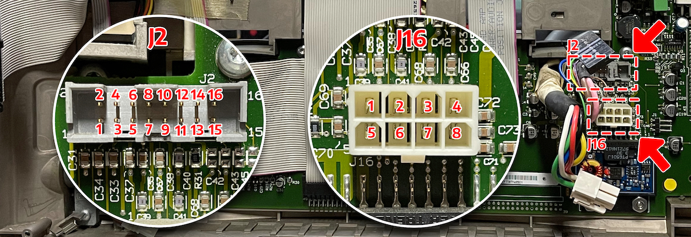

# TAM Umbilical 
As the TAM (Twentieth Anniversary Macintosh) grows older, replacement parts for this exceptional quark grow more rare and more expensive. This includes the "bass" station, which incorporates both audio and power supply in one unit. Without the bass station you can neither hear nor use the TAM.

The goal of this document is to provide information on the TAM's umbilical cord pinout and demonstrate a practical alternative for powering up a TAM.  

# J16 - Power Connectivity

J16 is the main attraction — and thankfully it's really not a hard act to follow. While the [technical specifications available from Apple](https://support.apple.com/kb/sp408?locale=en_US) are somewhat lacking, the table below clearly shows a standard 12V/5V 100 watt power supply (e.g., Pico PSU) will provide sufficient power.

It's important to note that the original bass unit is rated for 1000 watts. While it's not clear what the additional wattage is used for it should be established that some accessories may not work as intended without sufficient power.  

| Pin Number  | Source | Connections |
| ------------- | ------------- | ------------- |
| 1  | 12V  | C1(+), C19(+), C20(+), J2 (Sense) |
| 2  | 5V  | C2 |
| 3  | 5V  | C2 |
| 4  | 5V  | C2 |
| 5  | 12V  | C1(+), C19(+), C20(+), J2 (Sense) |
| 6  | GND  | C1, C19, C20, C2, C3, C4(+)* |
| 7  | GND  | C1, C19, C20, C2, C3, C4(+)* |
| 8  | GND  | C1, C19, C20, C2, C3, C4(+)* |
_* The negative connector of C4 is -12V_

# J2 - Data & Audio Connectivity

asasas

| Pin Number  | Source | Connections |
| ------------- | ------------- | ------------- |
| 1  | 5V  | J3 Pin 7 (Sense) |
| 2  | 5V  | Trickle to J3 Pin 3, C3(+) |
| 3  | GND  | J3 Pin 4 (Sense) |
| 4  | PFW  | J3 Pin 5 |
| 5  | 12V  | J16 Pin 1,5 (Sense), C1(+), C19(+), C20(+) |
| 6  | -12V  | C4, J3 Pin 1 |
| 7  | AMP OE  | U1 |
| 8  | SPKR LHS | J15 Pin 3 |
| 9  | SPKR LHS RTRN  | R31, J15 Pin 2 |
| 10 | SPKR RHS | J1 Pin 2 |
| 11 | SPKR RHS RTRN | R31, J31 Pin 2 |
| 12 | AMP RTRN | J3 Pin 13, R25 |
| 13 | AMP LHS | J3 Pin 14 |
| 14 | AMP RHS | J3 Pin 12 |
| 15 | NA | — |
| 16 | NA | — |
_LHS, "Left Hand Side". RHS, "Right Hand Side". SPKR, "Speaker". RTRN, "Return"_

# Connector

The TAM's umbilical appears to use a male `Deutsch HDP26-24-23ST` style connector. This connector contains 23 pins and is grounded on the outter ring as well as with a braided sheath. Female versions of this connector are available, and at the time of writing this document I found examples as low as $20 USD.

| Pin Number  | Connector |
| ------------- | ------------- |
| 1  | WIP |
| 2  | WIP |
| 3  | WIP |
| 4  | WIP |
| 5  | WIP |
| 6  | WIP |
| 7  | WIP |
| 8  | WIP |
| 9  | WIP |
| 10 | WIP |
| 11 | WIP |
| 12 | WIP |
| 13 | WIP |
| 14 | WIP |
| 15 | WIP |
| 16 | WIP |
| 17 | WIP |
| 18 | WIP |
| 19 | WIP |
| 20 | WIP |
| 21 | WIP |
| 22 | WIP |
| 23 | WIP |

# License 
All content in this repo is license as CC BY 4.0 ([License](LICENSE.md)) ([Creative Commons](https://creativecommons.org/licenses/by/4.0/)).
